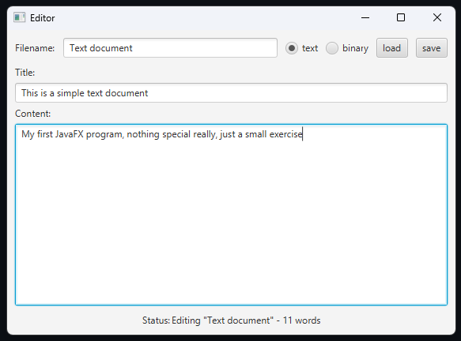

### A simple text editor made with JavaFX.
Since this is my first time using JavaFX and this was assigned to me as a school exercise, it's nothing special, really. But could be useful as a reference.
It was written following the [MVC](https://en.wikipedia.org/wiki/Model%E2%80%93view%E2%80%93controller) design pattern.

### Includes features such as:
- Saving files in text format or in a serialized object .dat file (called "binary" in the interface)
- Loading files from text format or serialized object .dat files
- Continuously updating word counter
- ... yeah that's it

Also, the view code is probably pretty horrendous.
